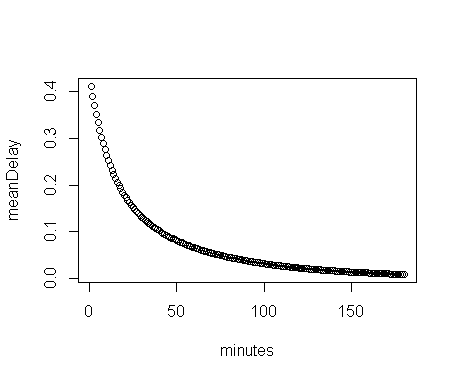

# Coya Business Intelligence challenge - Flight delay insurance product recommendation.

# Specification
There is an idea in the backlog regarding a new insurance product for flight delays. Using the following dataset and the latest year available:

http://stat-computing.org/dataexpo/2009/the-data.html

1) What can you conclude in terms of delay reasons and the time delays?
2) What can you recommend for exceptions in the coverage design?

Please provide the visual analysis using a public view on Tablaeu, Qlik or similar.
If you use some code to prepare the data, please submit it also within the git bundle.

# Our approach - business
We were thinking about how to grasp the potential flight delay insurance product so that we have a good context for the data analysis. In terms of clients we focused a variant aimed at retail clients to protect them from complications arising from flight delays (products could also be built for airlines, airports, travel agencies, etc. but we didn't explore this further). For were working with the following model in our heads: if your flight is significantly delayed (for example at least 60min delay on arrival to destination) you will be paid a fixed compensation (e.g. 500 EUR). Other variations are of course possible (variable compensation depending on lenght of delay, etc.) but we sticked to this basic model for our thinking.

Generally after seeing that the average flight delay rate is very high (more than 40% of flights have delays) we figured we need to think about the product setup to avoid the situation when a client would have to pay 300 EUR premium for a potential 500 EUR compensation, which wouldn't make sense for anybody.

## Flight delay threshold
The first important parameter is the threshold (minimum number of minutes of delay) from which the coverage would start. We analyzed the ratio of delayed flights as a % of all flights depending on the threshold in minutes. 

It can be seen from this that more than 40% of flights have some delay and it wouldn't make sense to cover this (too frequent). From the graph we consider 45 minutes a optimum threshold ("knee" of the graph) - such delays are not that frequent (it is a rare random event) but still frequent enough that the coverage brings value to the customer. Also this is a threshold which makes business sense as well - when you need to catch a connecting flight or be somewhere on time for a meeting you typically have 30 minutes slack but 45 minutes is typically already a problem.

## What does delay depend on
We studied the delay data in more detail to get an understanding of the underlying risk, get an idea how to price the product and what kind of exclusions to potentially introduce into the product. The underlying visual analyses in Tableau can be found in here (unfortunately the data and analysis were too complex to upload to Tableau Public):
https://datasentics.slack.com/files/U23ABQCN7/F7AUNDKNX/coya.twbx

To open the file download Tableau reader:
https://www.tableau.com/products/reader/download

The main conclusions are that the delay rates (>45 minutes) highly depend on several key factors:

• seasonality - very stronly seasonality on the level of months in a year, also strong seasonality within a week

• time of day - very strong dependency, low in the morning and gradually growing the whole day - this is probably due to delay cummulation - in the morning the plane starts flying back and forth, the later it is in the day the more flights it has done and the greater the chance that there was some problem somewhere -> lesson learned: fly in the morning

• carrier - big differences between carriers

• airports - very strong dependency on airports, not only related to amount of traffic (e.g. East cost US much worse than West coast even though the traffic is similar)

## Pricing
We would propose a risk based pricing model based on the observed dependencies (similar to for example motor insurance where the premium depends on several risk factors such as age, region, car, etc.). We have created a simple pilot pricing model in R (GLM), which is described in more detail in it's own section.

## Question to reasons
The reasons for delay are analyzed in the dashboard "Reasons". The key conlusions are:

• late aircraft arrival is the main reason - it would be very interesting to analyze also the original reason (what delayed the aircraft on the last flight) - in our backlog of things to look at before our call next week

• carrier reasons (e.g. technical problems of plane, boarding complications, etc.) are the next most important reason not suprisingly

• NAS (due to air traffic control - e.g. too big traffic and planes has to circle) is also similarly import

• weather and security are less imporant, however weather delays are typically more severe

## Question to exceptions
Based on the above we would propose to consider some of the following exceptions and conditions:

• the insurance should not be concluded the same day due to arbitrage/speculation/anti-selection/fraud - a person could see that a previous flight of the same plane was delayed and that it will most likely lead to a delay of his own flight

• it might make sense to limit the product only to connecting flights (i.e. the claim is valid only if a connecting flight was missed), otherwise again it could be more prone to speculation/anti-selection

• it might make sense to exclude some of the most risky flights in terms of time of day/week/year, carrier, origin/destination

# Pricing model

# Our approach - technical
To be efficient and come to a reasonable result in short time (one day) we used the tools where we are the most comfortable: 1) Python + SQL for downloading data and data preparation - running and orchestrated inside Keboola cloud ETL platform
2) Snowflake (cloud analytical DWH) for storing prepared data as a source for analytics
3) Tableau for visualisation of results
4) R for pilot pricing predictive model

## Data preparation - Python + SQL scripts managed/orchestrated in Keboola
1) Download, unzip and parse flight delay data - [flight_delay_extractor.py](src/flight_delay_extractor.py)
2) Download and parse airline names codebook - [airlines_codes_extractor.py](src/airlines_codes_extractor.py)
3) Download and parse (incl. parsing geo information) airport codebook  - [airport_codes_extractor.py](src/airport_codes_extractor.py)
4) Join all data and prepare for analysis - [extracts_join.sql](src/extracts_join.sql)
5) Write into Snowflake database

## Visualisation - prepared in Tableau desktop
1) Connect to Snowflake database through ODBC
2) Calculate key metrics (whether a flight is delayed, delay rate, main reason for delay, number of reasons, etc.)
3) Perform visualisations
4) Save as twbx file for Tableau reader

