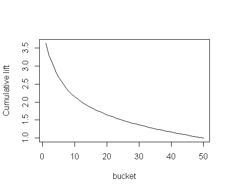
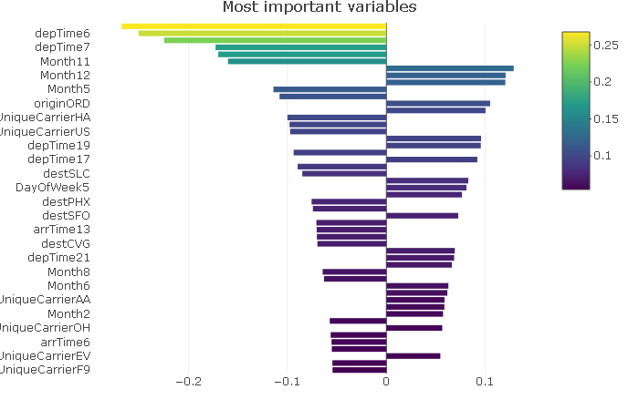

# model description
The main goal of "flight delay model" is to find the probabilty of delay for each customer (as a basis for risk based pricing). As already mentioned, the target is a factor variable isDelayed, i.e. 0 stands for delay <= 45 min, 1 represents delay > 45 min. We choose a generalized linear model (GLM) with binomial link function (logistic regression). We filtered out the cancelled flights (can be modeled seperately). Dataset is subsampled for computational effectivness. 

## feature selection

### Target:  isDelayed, i.e. 0 stands for delay <= 45 

### Explanatory variables: 
Factors:
"Month" with levels 1-12, "DayOfWeek" with levels 1-7, "CRSDepTime" and "SRSArrTime" with levels 0-23,
"UniqueCarrier", 30 most frequent "Origin" and "Dest" (less frequent are labelled as "Other" 
Numerical: 
"CRSElapsedTime"

## Evaluation

### Split
The dataset is split into train and test set (70-30). The logit model is than trained on the train set and the predictions of the delay probabilities are made on the test set. We use the prediction for lift curve calculation to verify our approach. 

### Dummy and scale
We used one hot encoding (dummies 0/1) to make numerical variables from the factors and then scaled train and test set separately (scaled each element by subtracting the mean and dividing by the sd).

## lift curve
A relatively nice lift of cca 3 for the worst 5% is achieved. This means that the model is able to select the worst 5% of flights which have 3x as large probability of delay than average. This could be potential candidates for exclusion.

## variable importance bar graph
As seen in the Tableau visualisation the most important factors contributing to the model are Months (for example 10 and 11 are good months and 12 is a bad month), time of day (morning is good, evening bad), carriers and airports.

