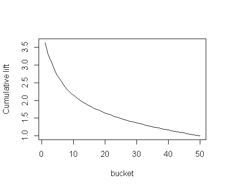
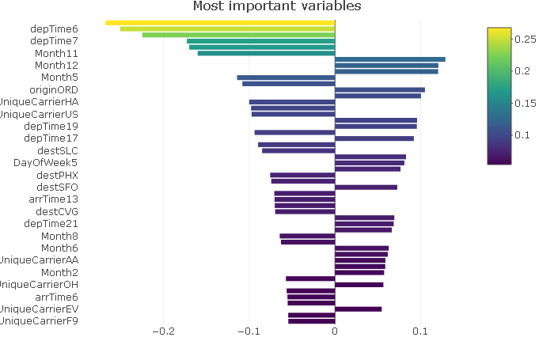

# model description
The main goal of "flight delay model" is to find the probabilty of delay for each customer. As already mentioned, the target is factor variable isDelayed, i.e. 0 stands for delay <= 45, 1 represents delay > 45. Therefore we chose general linear model with binomial link function (logistic regression). We filtered out the cancelled flights (can be modeled seperately). Dataset is subsampled due to computational effectivness. 

## feature selection
### Target:  isDelayed, i.e. 0 stands for delay <= 45 
### Explanatory variables: 
Factors:
"Month" with levels 1-12, "DayOfWeek" with levels 1-7, "CRSDepTime" and "SRSArrTime" with levels 0-23,
"UniqueCarrier", 30 most frequent "Origin" and "Dest" (less frequent are labelled as "Other" 
Numerical: 
"CRSElapsedTime"

## Evaluation
### Split
The dataset is split into train and test set (70-30). The logit model is than trained on the train set and the predictions of the delay probabilities are made on the test set. We use the prediction for lift curve calculation to verify our approach... 

### Dummy and scale
We used one hot encoding (dummies 0/1) to make numerical varaibles from the factors and then scaled train and test set separately (scaled each element by subtracting the mean and dividing by the sd).

## lift curve

## variable importance bar graph

