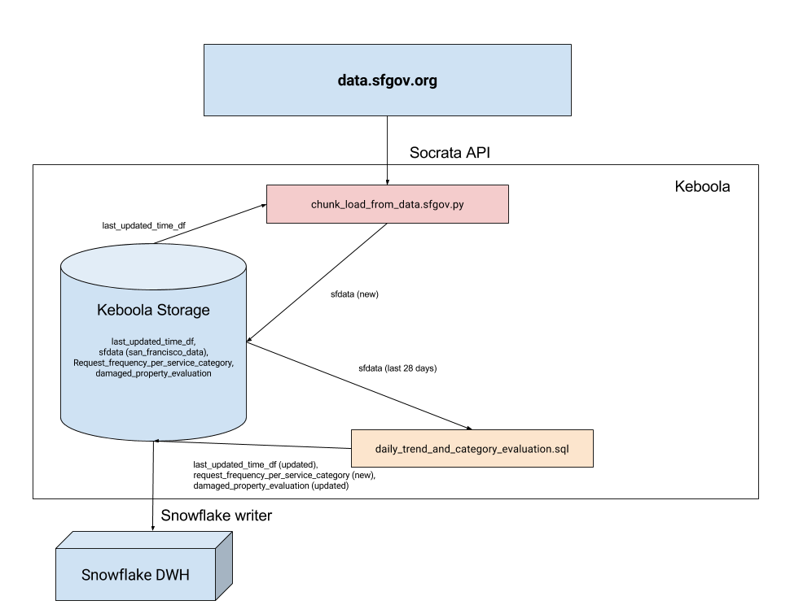

# Coya Data Engineering challenge - Specification

We have a small task for you for us. At Coya want to collect public data to assess the plausibility of claims. The data team has found the following dataset:

https://data.sfgov.org/City-Infrastructure/Case-Data-from-San-Francisco-311-SF311-/vw6y-z8j6

## First mini-task
Create a document (or edit this one) telling us your ideas on the following:

As a general concept, how would you design a pipeline which extracts this data set? And how would you extend the pipeline to include further data sets from other data sources?

## Second mini-task:
Please create a procedure to achieve the following: evaluate the daily trend on Damage Property Category in particular, and category distribution. What considerations should be taken regarding data quality?

## Deliverable:
Please include everything as commits in a git repository starting from this one. Don't worry too much about making it all nice or perfect, we'll discuss it later with you. Please send us back this repository as a git archive or a link to a git repository.

# Our approach (both mini-tasks)

Looking at the data source (sfgov) we found the following key information:

• the data is updated on a daily basis -> we should aim for an automated refresh of the data on a daily basis

• sfgov provides access to all it's data through an API -> this is the way we want to go (most reliable, controlable and comfortable)

• the whole dataset is decently big (>1GB) -> it is not a good idea to do a full load each time but we should setup an incremental pipeline (in a real-life scenario we would need to confirm that no historical changes/fixed are happening, for now we ignored this)

Because we want to setup a regular pipeline to download and process data via an API and we also want to extend this pipeline by other data sources in the future we opted to use an ETL tool, which will allow us to manage and orchestrate the invidiual sub-pipelines/scripts. Because we want to use the data further for analytics we opted to store the data (historized) in a analytical DWH (columnar-based).

For reasons of efficiency and costs we choose to use the Keboola platform (cloud ETL tool on AWS where we have a free development/PoC environment including a Snowflake analytical cloud DWH also based on AWS). Alternatively something similar could be achieved in similar platforms (AWS + Databricks+Python/Scala+Spark+Redshift, GCP+Dataflow+Python/Java+BiqQuery+CRON, Azure+Data Factory+SQL, MS SQL + SSIS + SQL, Airflow, etc.). We have in our backlog for next week that we also want to try out the Databricks variant and simulate real-time streaming of the dataset + connect a live dashboard to it.

The following picture illustrates how it currently works:

The individual scripts can be found [here](src).

The Keboola platform ensures that the scripts are run every day at 02:00AM CET time. The Snowflake DWH is therefore being automatically being updated very day. We have also quickly visualized the resulting analysis via Tableau Public but unfortunately it is not possible to trigger an automatic refresh in Tableau Public - we have this in our backlog for next week to use a different visualisation tool to ensure a shareable automatically refreshed dashboard.
https://public.tableau.com/profile/petr.bednarik6429#!/

Regarding data quality we did not have time to go into any depth so at the moment we are basically relying on the fact that the data are decent. Generally these are the types of data quality checks we would typically go through:

• perform data profiling of indiviudal attributes, get a feel for what are normal/valid values and what are errors/outliers, understand if missing values are okay or not

• validate against codebooks if there are any (address codebooks, ZIP code codebooks, etc.)

• if there were more tables with relations then validate the relations

• look for probable duplicates (more or less identical rows)

• internal consistency checks (that the date closed is after the date opened, for example in flight delay challenge that sum of minutes split by individual delay sums up to the total delay)

• more global checks such as whether there is some unexpected big change in average new values compared to what was in the past

We would implement these checks as part of the loading ETLs (ideally in a parametrized way reusing some cross-project data quality code) and store the identified errors into a data quality issue datamart for further analysis and resolution (ideally have DQ dashboards on top of these on which somebody is looking and acting on them).
